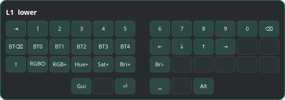

# Corne Layer Overlay

Miniatura do seu Corne no canto superior direito da tela, que troca a camada
exibida **ao vivo** sempre que ela é ativada no teclado.

O keymap (rótulos das teclas) é lido do `../config/corne.keymap`; a camada ativa
chega do teclado via Raw HID (módulo KeyPeek layer notifier no firmware).



## Por que precisa mexer no firmware?

O ZMK resolve as camadas **dentro do teclado** — o PC não vê o `&mo 1`/`&mo 2`,
só o keycode final. E o protocolo do ZMK Studio **não** expõe a camada ativa
(confirmado nos `.proto`: as únicas notificações são `unsaved_changes` e
`lock_state`). Então a única forma de o PC saber a camada real é o firmware
*emitir* esse evento. Usamos os módulos do projeto [KeyPeek](https://github.com/srwi/keypeek)
para isso (apenas o stream de eventos; o overlay é este, próprio do Corne).

## 1. Firmware (já configurado neste repo)

As mudanças já estão aplicadas:

- `config/west.yml` — módulos `zmk-raw-hid` (zzeneg) e `zmk-keypeek-layer-notifier` (srwi)
- `build.yaml` — shield `raw_hid_adapter` na metade central (`corne_left`)
- `config/corne.conf` — `CONFIG_ZMK_KEYPEEK_LAYER_NOTIFIER=y`

> Mantivemos o ZMK em `v0.3`. Os módulos rastreiam `main`; as APIs que eles usam
> (`zmk_keymap_layer_active`, `layer_state_changed`) são antigas e compatíveis.
> Se o build falhar por API faltando, suba o `zmk` para `revision: main` no west.yml.

Faça o build (GitHub Actions do repo ou local com `west`) e **grave as duas
metades**. Se já tinha pareado por Bluetooth, pode precisar reparear.

## 2. Dependências do app (Arch)

```bash
sudo pacman -S python-gobject gtk4 gtk4-layer-shell
```

## 3. Permissão de acesso ao Raw HID (udev)

```bash
sudo cp 99-zmk-raw-hid.rules /etc/udev/rules.d/
sudo udevadm control --reload-rules && sudo udevadm trigger
```

Confirme o VID/PID depois de gravar (`lsusb`, procure "ZMK"); ajuste a regra se
necessário. Sem isso o app mostra "Sem permissão".

## 4. Rodar

```bash
python3 corne_layer_overlay.py            # some na camada base, aparece ao ativar outra
python3 corne_layer_overlay.py --always   # sempre visível
python3 corne_layer_overlay.py --scale 0.8
```

Opções: `--keymap CAMINHO`, `--scale N`, `--always`, `--linger MS`.

O script se re-executa sozinho com `LD_PRELOAD` da `libgtk4-layer-shell.so`
(necessário no Wayland para o overlay ancorar e ficar acima sem roubar foco).

## 5. Autostart no niri

Adicione ao seu `~/.config/niri/config.kdl`:

```kdl
spawn-at-startup "python3" "/home/davi/Projetos/zmk-corne/tools/corne_layer_overlay.py"
```

## Como funciona o protocolo

O `zmk-keypeek-layer-notifier` envia, a cada troca, um report Raw HID de 32 bytes
(Usage Page `0xFF60`, Usage `0x61`):

| byte | conteúdo |
|------|----------|
| 0    | `0xFF` (marcador de pacote de camada) |
| 1    | `4` |
| 2–5  | default layer state (uint32 LE) |
| 6–9  | **bitmask das camadas ativas** (uint32 LE) |

O overlay localiza o `/dev/hidrawN` correto pelo report descriptor, lê o bitmask
e exibe a camada de bit mais alto (a que o ZMK resolve).
